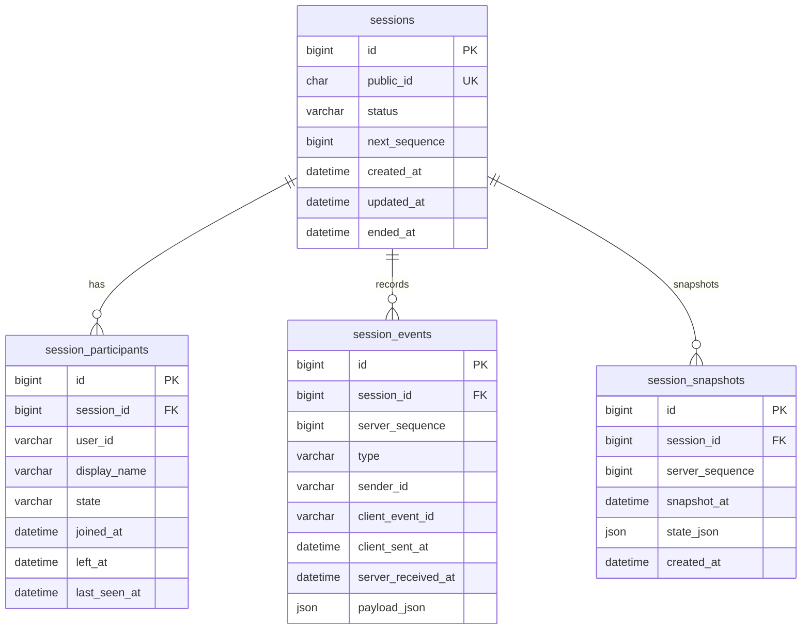

# ERD

## Design Notes

- `public_id`는 API 외부 노출용 UUID다.
- `session_events.payload_json`은 이벤트 타입별 payload 확장을 위해 JSON으로 둔다.
- 중복 방지는 `(session_id, sender_id, client_event_id)` unique key로 처리한다.
- replay 정렬은 `(session_id, server_sequence)`를 기준으로 한다.
