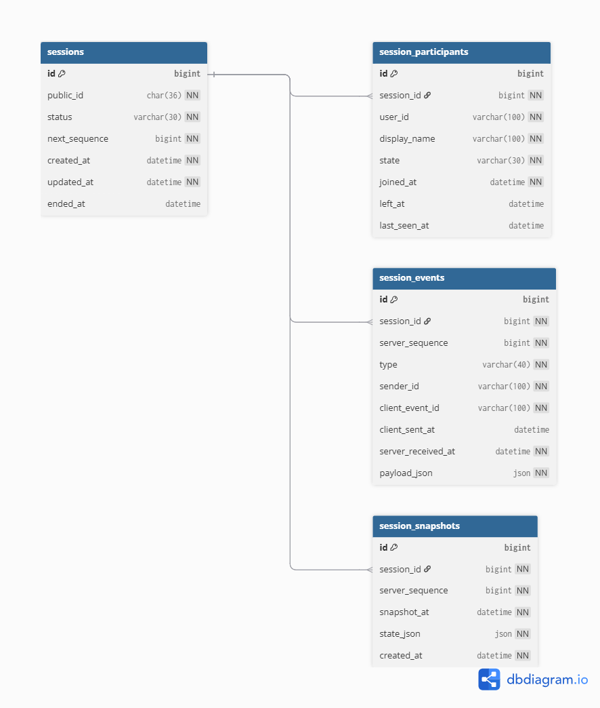

# ERD

## Table Relationships

- `sessions` 1:N `session_participants`
- `sessions` 1:N `session_events`
- `sessions` 1:N `session_snapshots`

## Notes

- `sessions.public_id`는 API 외부 노출용 UUID다.
- `session_events`가 append-only event store이며 상태 복원의 source of truth다.
- `session_participants`는 join, leave, disconnect, reconnect 결과를 빠르게 보기 위한 current-state projection이다.
- `session_snapshots`는 timeline 복원 비용을 줄이기 위한 snapshot 저장소다.
- 별도 `users` 테이블은 두지 않고, `user_id`와 `sender_id`는 외부 인증 시스템의 사용자 식별자로 가정한다.
- 중복 방지는 `session_events`의 `(session_id, sender_id, client_event_id)` unique key로 처리한다.
- replay 정렬은 `server_sequence`를 기준으로 한다.

## Normalization And JSON Trade-Off

정규화한 데이터:

- `sessions`: 세션 상태와 sequence allocator 역할
- `session_participants`: 현재 참여자/presence projection
- `session_events`: append-only event store
- `session_snapshots`: replay 최적화용 snapshot 저장소

JSON으로 둔 데이터:

- `session_events.payload_json`
- `session_snapshots.state_json`

선택 근거:

- 이벤트 타입별 payload 구조가 달라질 수 있으므로 event payload는 JSON으로 두어 확장성을 확보한다.
- message content, displayName, endedBy 같은 이벤트별 속성은 payload에 둔다.
- hot path 필터링 대상인 `session_id`, `server_sequence`, `sender_id`, `client_event_id`, `server_received_at`은 별도 column으로 정규화해 인덱스를 건다.

트레이드오프:

- JSON payload는 스키마 변경에 강하지만, payload 내부 필드 조건 검색에는 약하다.
- 핵심 조회 조건은 JSON 내부에 넣지 않고 column으로 승격한다.
- projection table인 `session_participants`는 비정규화된 현재 상태 캐시지만, source of truth는 `session_events`다.
